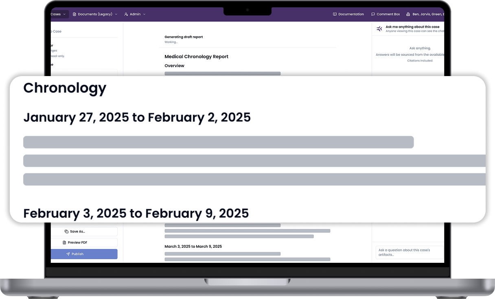
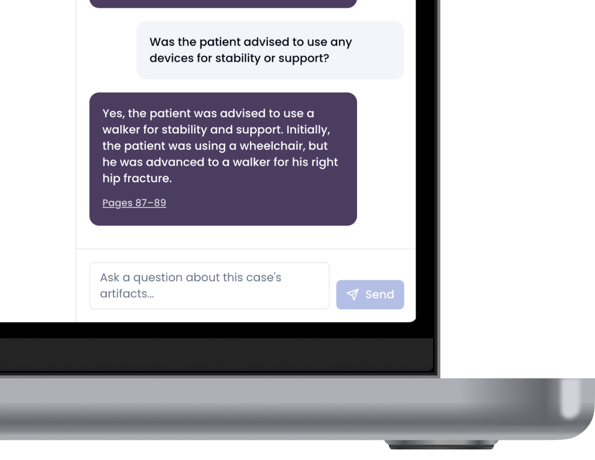
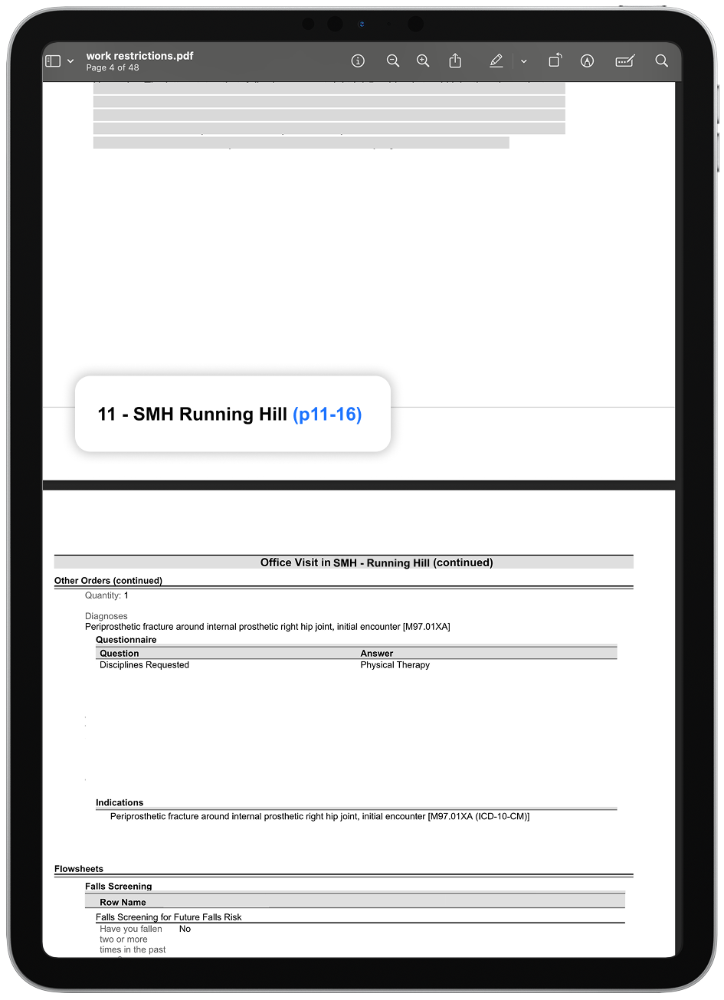
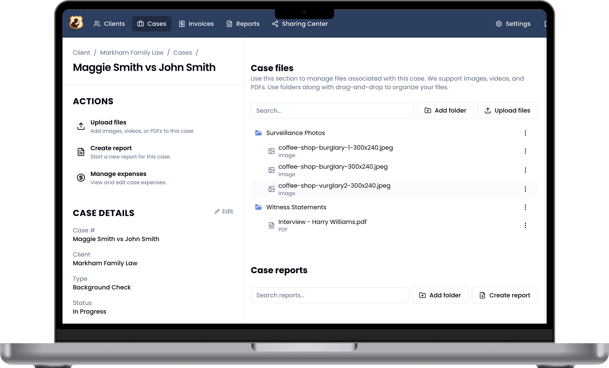
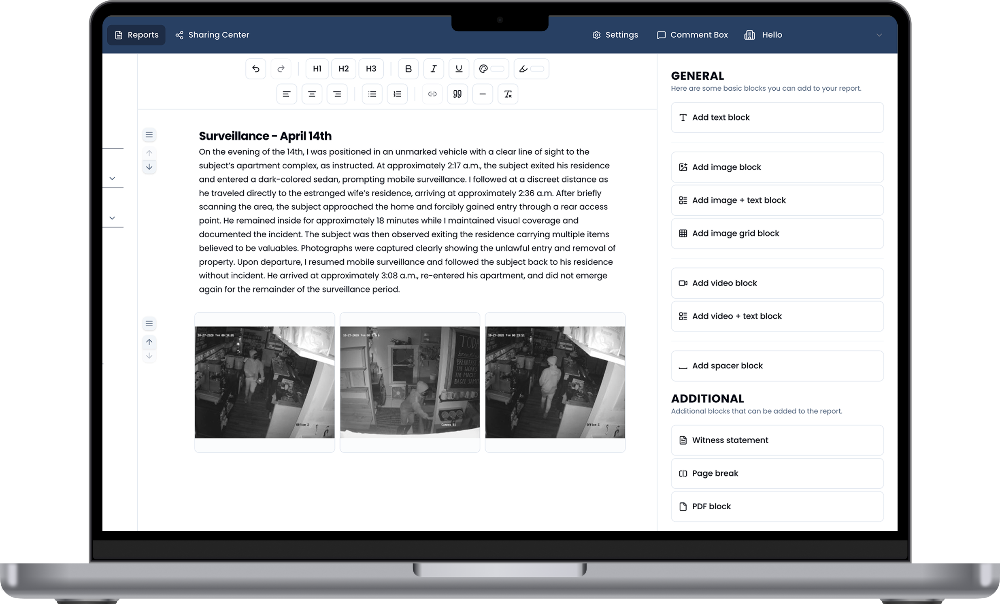
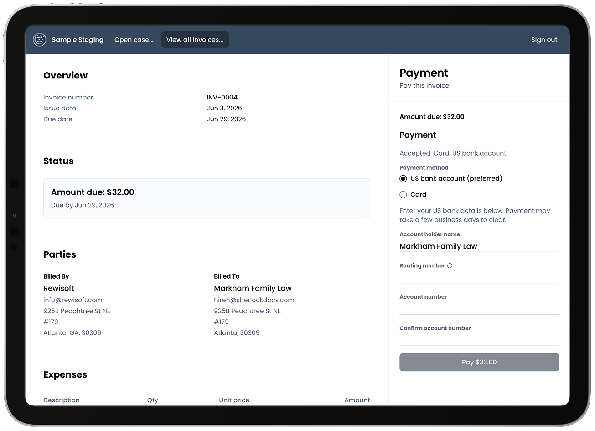

# Hi, I'm Hiren

I build products at the intersection of **software**, **design systems**, and **AI-assisted development** with a growing interest in applying those skills to research and healthcare data.

 

# Live projects

### &nbsp;RiskAngle

<a href="https://www.riskangle.com/">www.riskangle.com</a>

AI platform that turns dense medical records into actionable summaries and chronologies. Built for insurance and legal teams.

| Generative Summaries | AI Assistant | Cited Content |
| -------------------- | ------------ | ------------- |
|  |  |  |

 

### &nbsp;SherlockDocs

<a href="https://www.sherlockdocs.com/">www.sherlockdocs.com</a>

Unified case management for private investigation agencies - cases, tasks, invoicing, media storage, and reports in one platform.

Technical Highlights:
- Microservice Architecture
- Tech-agnostic backends. Core service is Python+Django while Invoicing service is Node+tRPC

| Case Management | Report Writer | Invoicing |
| --------------- | ------------- | --------- |
|  |  |  |

 

# 🔭 Currently building

**ArtisanUX** - A custom UI library with pre-defined layouts and advanced features so developers can focus on content. I am currently designing a new copilot experience where an AI agent is the primary mode of interaction **without sacrificing manual workflows**.

**AI Development Agency** - A coordinated team of specialized AI agents that automate development like a formal tech org: a coordinator delegates to specialty subagents and loops in the developer for feedback along the way. The goal is an experience where the developer feels like the **leader of a robust team**, not a solo prompt engineer.

 

# 🤝 Open to collaborating

**Oncology research** - I'm interested in helping research groups **operationalize their data** so findings turn into action faster. I'm also exploring ways to help teams **monetize data responsibly** so programs can become self-sufficient and sustainable.

**Operational Consolidation** - The SaaS marketplace has gotten overwhelming. Every little aspect of a company's operations now has a special dedicated SaaS, each with its own subscription that is only getting more expensive. I am interested in creating proprietary platforms for large businesses to replace all of their software vendors with a single comprehensive one that they own. 

If you're working on related problems, I'm happy to connect.

 

# 💬 Ask me about

Product engineering · design systems · agentic workflows · research data platforms

<!--
**hi-patel/hi-patel** is a special repository: its README appears on your GitHub profile.
-->
